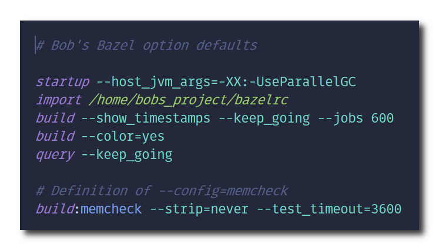

# tree-sitter-bazelrc

Useful for getting tree sitter based syntax highlighting in your favourite editor for [bazelrc](https://bazel.build/run/bazelrc) files!

## Notes

* Experimental - breaking changes are likely
* Grammar may not be 100% accurate (contributions are welcome!)

